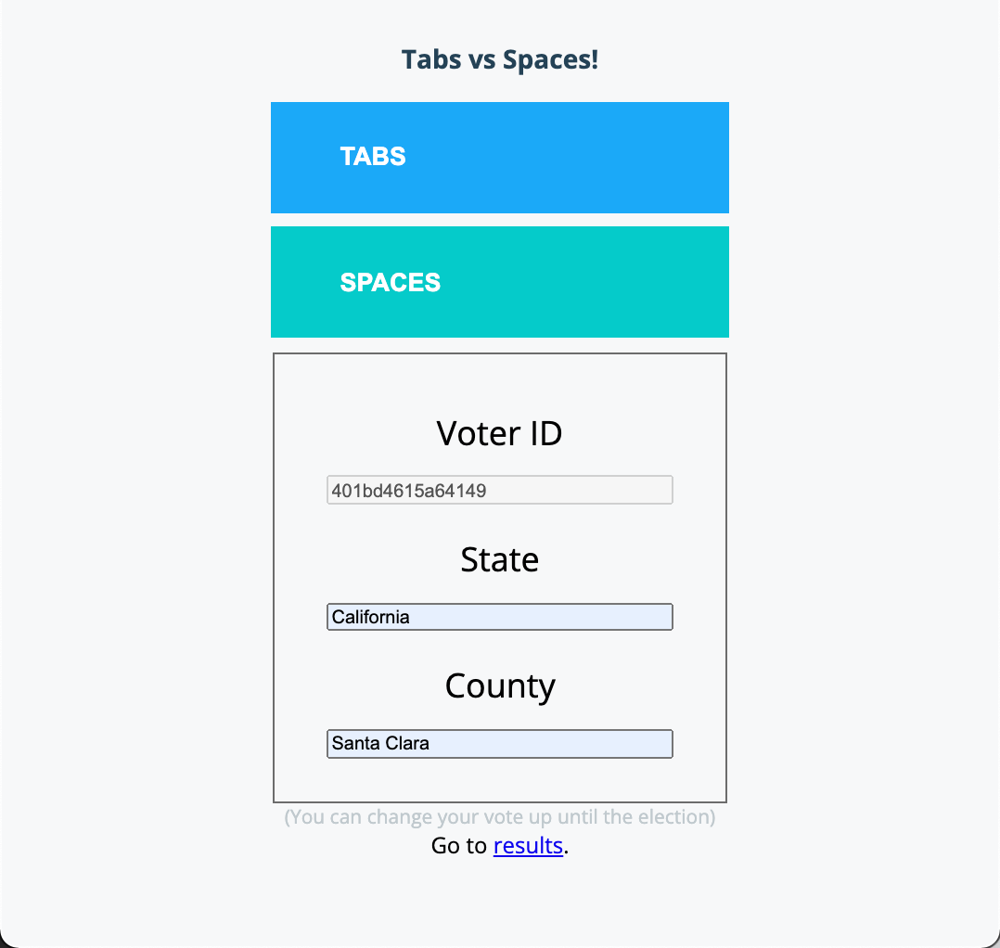

# Voting App

Simple voting app that consists of three services for highlighting running
containerized applications on Google Cloud.

- **web** - Web frontend (Python Flask app)
- **vote** - Vote API microservice (Node.js Express app)
- **database** - Backend (Postgres SQL database)



If you prefer demo apps with more microservices and sophistication (but take a bit
longer to start), try these out:

 - https://github.com/GoogleCloudPlatform/microservices-demo
 - https://github.com/GoogleCloudPlatform/bank-of-anthos

## Quickstart (GKE with Autopilot)

### Prerequisites

- [Install Google Cloud SDK (gcloud)](https://cloud.google.com/sdk/docs/install)
- [Install Skaffold](https://skaffold.dev/docs/install/)

### Create an Autopilot cluster

With an Autopilot cluster, GKE manages compute infrastructure for Kubernetes,
freeing developers from physical cluster administration to focus on building and
maintaining applications.

You will need a Google Cloud project with billing enabled.

Follow either of the following instructions to create an Autopilot cluster:

- Command line instructions using [gcloud](./scripts/gcloud)
- Code sample using [Python](./scripts/python)

### Build and deploy the app

You will need to install Skaffold on your system. This tool uses a file
([./skaffold.yaml](./skaffold.yaml)) that configures the build and deploy tasks
for the application:

- Application components will be built on Google Cloud using Cloud Build so
  that you won't need to install any other tools, including Docker, on your 
  own system.
- The application will be deployed to the GKE Autopilot cluster you created 
  previously.


1. **Install Skaffold on your system**

Install [Skaffold for CLI](https://skaffold.dev/).

2. **Use scaffold to run the deployment**

Ensure the following environment variables are set:

- **PROJECT_ID** set to your project
- **REGION** set to the region
- **CLUSTER_ID** set to your cluster

```text
export PROJECT_ID=my-project
export REGION=region
export CLUSTER_ID=my-cluster
```

Get authorization to access your project.

```text
gcloud auth login
```

Get Kubernetes credentials for the GKE cluster in your project.

```text
gcloud container clusters get-credentials \
--project $PROJECT_ID \
--region $REGION \
$CLUSTER_ID
```

Run the following `skaffold` command. You may be prompted to enable various
APIs, such as Cloud Build.

```text
skaffold run --default-repo=gcr.io/$PROJECT_ID/voting-app --tail
```

## Test the app

Print the public address of the app.

```text
echo "http://"$(kubectl get service web-external -o jsonpath="{.status.loadBalancer.ingress[0].ip}{'\n'}")
```

- Cast votes at this address.
- Display voting results by appending `/tally/candidates` to the web address.

Skaffold displays streaming log output in the terminal.

> **Note:** you can also get the public address from the **External endpoints** field from this
> link (substituting values for `REGION`, `CLUSTER_ID` and `PROJECT_ID`)
> https://console.cloud.google.com/kubernetes/service/REGION/CLUSTER_ID/default/web-external/overview?project=PROJECT_ID
## Clean up

Press `Ctrl-C` to stop Skaffold log streaming.

To stop the voting app from running and to delete Kubernetes resources in the cluster, enter:

```text
skaffold delete
```

## Local development & testing

### Prerequisites

1. Install Docker.
2. Clone this repo and change directory to it.

```text
git clone https://github.com/subfuzion/voting-demo.git
cd voting-demo
```

You will execute all commands in this from the top-level directory of the repo.

### Run the complete application

```text
docker compose up
```

Wait until you see the following log entry in the terminal output:

```text
voting-demo-web-1       | INFO:waitress:Serving on http://0.0.0.0:8080
```

Open a brower and navigate to http://localhost:8080

When finished, run:

```text
docker compose down --remove-orphans
```

### Test the database package

The database package is a Node.js package for working with the database. It's
meant to be used by the `vote` microservice. It's published to
[npm](npmjs.com) as
[@subfuzion/vote-database](https://www.npmjs.com/package/@subfuzion/vote-database).

To test it:

```text
docker compose -f tests/docker-compose.postgres.test.yaml run sut
```

After making changes to the package source code, run:

```text
docker compose -f tests/docker-compose.postgres.test.yaml down --remove-orphans
docker compose -f tests/docker-compose.postgres.test.yaml build
docker compose -f tests/docker-compose.postgres.test.yaml run sut
```

When finished, run:

```text
docker compose -f tests/docker-compose.postgres.test.yaml down
```

### Test the vote service

```text
docker compose -f tests/docker-compose.vote.test.yaml run sut
```

After making changes to the package source code, run:

```text
docker compose -f tests/docker-compose.vote.test.yaml down --remove-orphans
docker compose -f tests/docker-compose.vote.test.yaml build
docker compose -f tests/docker-compose.vote.test.yaml run sut
```

When finished, run:

```text
docker compose -f tests/docker-compose.postgres.test.yaml down
```

### Partially containerized dev environment

Sometimes it's convenient to run some services, such as the database, in a
container, while editing/testing/debugging other services uncontainerized.

> Note: for any of the `docker compose up` commands, you can run services
> detached by appending the `-d` option. To view log output, run
> `docker compose logs` (with the `-f` option to stream output).
**To run the database in a container:**

```text
docker compose up postgres
```

**To run both the database and vote services in containers:**

```text
docker compose up postgres vote
```

When running an uncontainerized version of either the vote or the web services,
you will need to set certain environment variables so the services know how to
connect to their upstream dependencies:

**To run the vote service uncontainerized:**

```text
export PGHOST=localhost
(cd src/vote; npm run)
```

**To run uncontainerized vote tests:**

```text
export VOTE_HOST=localhost;
VOTE_PORT=8080
(cd src/vote; npm test)
```

**To run the web service uncontainerized:**

```text
export HOST=localhost
export PORT=5000
export VOTE=http://localhost:8080
(cd src/web; python app.py)
# with reloading
hupper -m waitress --port $PORT src.web.app:app
```
